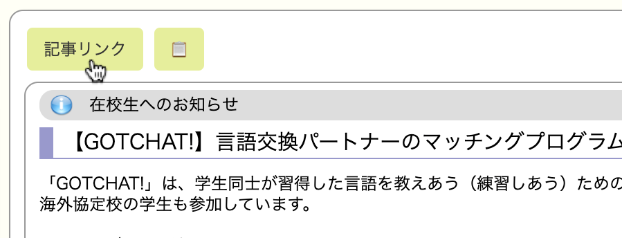

# userscript-twins-insert-article-url-button

筑波大学のtwinsに「個別のお知らせページを開くボタン」と「他人と共有できるURLをコピーするボタン」を追加するスクリプトです。

## スクリーンショット

スクリーンショットのページは[パブリックに公開されているお知らせ](https://twins.tsukuba.ac.jp/campusweb/campussquare.do?_flowId=POW1200000-flow&_campus_new_portal=true&_action_id=displayPortletRequest&calledFlow=keiji&keijitype=4&genrecd=281&seqNo=2052)です。大学内の内部限定公開の情報は含まれません。

## 使用方法

1. ブラウザの拡張機能[Tampermonkey](https://www.tampermonkey.net/)をインストールします。
1. [twins-insert-article-url-button.user.js](https://github.com/shuuji3/userscript-twins-insert-article-url-button/raw/main/twins-insert-article-url-button.user.js)をクリックすると、スクリプトのインストール画面が表示されます。コードの内容を確認してインストールします。
1. 特定のお知らせを表示すると、上部に「記事リンク」ボタンと「📋」ボタンが追加されます。
    - 「記事リンク」ボタンをクリックすると、新規タブで特定の記事だけが表示されるページが表示されます。
    - 「📋」ボタンをクリックすると、特定の記事だけが表示されるページのURLがクリップボードにコピーされます。

## ⚠ 注意

- 「記事リンク」をクリックしてページを表示すると、URLが強制的に壊れたリンクに書き換えられてしまいます。URLを他の人と共有したい場合には「📋」ボタンを活用してください。
- パブリックに公開されているページの場合、URLから誰でもアクセスできます。
- パブリックに公開されていないページの場合、URLからアクセスする前にあらかじめtwinsでログインしておき、ブラウザにセッションが残っている必要があります。

## ライセンス

- [GNU GPLv3](https://www.gnu.org/licenses/gpl-3.0.ja.html)
- ただし、スクリーンショットの画像ファイルを除きます。

## 関連リポジトリ

- [shuuji3/twins-notification: 📡 筑波大学の Twins の掲示を通知するプログラム](https://github.com/shuuji3/twins-notification)
